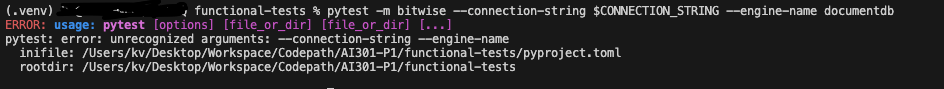

# Contribution [#]: [Issue Title]

**Contribution Number:** [1]  
**Student:** [Krishna Sai Sevilimedu Veeravalli]  
**Issue:** [https://github.com/documentdb/functional-tests/issues/202]
**Status:** [Phase I Complete]

---

## Why I Chose This Issue

[1-2 paragraphs explaining why this issue interests you, how it matches your skills/learning goals, what you hope to learn]
I chose this issue beacaise it is a well-scoped, test‑driven bug. The $bitAnd operator is narrow enough to be approachable but meaningful enough to matter. bitwise expressions often appear in data transformation pipelines where silent incorrectness is hard to catch without explicit coverage. I can reproduce it deterministically, validate the fix with the same test, know I am improving DocumentDB validation tests and improve the test suite.

---

## Understanding the Issue

### Problem Description

[In your own words, what's broken or missing?]

### Expected Behavior

[What should happen?]

### Current Behavior

[What actually happens?]

### Affected Components

[Which parts of the codebase are involved?]

---
## Phase 2: Fix

## Reproduction Process

### Environment Setup

[Notes on setting up your local development environment - challenges you faced, how you solved them]

### Steps to Reproduce

1. [Step 1]
2. [Step 2]
3. [Observed result]

### Reproduction Evidence

- **Commit showing reproduction:** [Link to commit in your fork]
- **Screenshots/logs:** [If applicable]
- **My findings:** [What you discovered during reproduction]

## Environment Setup:

git clone https://github.com/documentdb/functional-tests.git

cd functional-tests

python -m venv .venv

pip install -r requirements.txt

export CONNECTION_STRING="mongodb://localhost:27017"

pytest documentdb_tests/ -m bitwise --connection-string $CONNECTION_STRING --engine-name documentdb

## Steps to Reproduce:
Step 1:
`git clone https://github.com/documentdb/functional-tests.git`

Step 2:
`cd functional-tests`

Step 3:
`python -m venv .venv`

Step 4:
`pip install -r requirements.txt`

Step 5:
`export CONNECTION_STRING="mongodb://localhost:27017"`

Step 6:
`pytest documentdb_tests/compatibility/tests/core/operator/expressions/bitwise/bitAnd/test_smoke_expression_bitAnd.py`

# Test Error observed in Terminal after running Step 6:

```
======================================= test session starts ========================================
platform darwin -- Python 3.14.4, pytest-9.1.0, pluggy-1.6.0 -- /Users/kv/Desktop/Workspace/Codepath/functional-tests/.venv/bin/python3.14
cachedir: .pytest_cache
metadata: {'Python': '3.14.4', 'Platform': 'macOS-26.4.1-arm64-arm-64bit-Mach-O', 'Packages': {'pytest': '9.1.0', 'pluggy': '1.6.0'}, 'Plugins': {'xdist': '3.8.0', 'json-report': '1.5.0', 'timeout': '2.4.0', 'metadata': '3.1.1'}}
rootdir: /Users/kv/Desktop/Workspace/Codepath/functional-tests/documentdb_tests
configfile: pytest.ini
plugins: xdist-3.8.0, json-report-1.5.0, timeout-2.4.0, metadata-3.1.1
timeout: 300.0s
timeout method: signal
timeout func_only: False
collected 1 item                                                                                   

documentdb_tests/compatibility/tests/core/operator/expressions/bitwise/bitAnd/test_smoke_expression_bitAnd.py::test_smoke_expression_bitAnd FAILED [100%]


============================================= FAILURES =============================================
___________________________________ test_smoke_expression_bitAnd ___________________________________
documentdb_tests/compatibility/tests/core/operator/expressions/bitwise/bitAnd/test_smoke_expression_bitAnd.py:29: in test_smoke_expression_bitAnd
    assertSuccess(result, expected, msg="Should support $bitAnd expression")
documentdb_tests/framework/assertions.py:145: in assertSuccess
    raise AssertionError(_format_exception_error(result))
E   AssertionError: [UNEXPECTED_ERROR] Expected success but got exception:
E   {'code': 31325, 'msg': 'Invalid $project :: caused by :: Unknown expression $bitAnd'}
===================================== short test summary info ======================================
FAILED documentdb_tests/compatibility/tests/core/operator/expressions/bitwise/bitAnd/test_smoke_expression_bitAnd.py::test_smoke_expression_bitAnd - AssertionError: [UNEXPECTED_ERROR] Expected success but got exception:
{'code': 31325, 'msg': 'Invalid $project :: caused by :: Unknown expression $bitAnd'}
======================================== 1 failed in 0.30s =========================================
```

# Expected Output in Step 6

Test should pass wirh 1 test passed output


Branch Link:
https://github.com/krishnasai453/functional-tests/tree/fix-issue-202-add_bitAnd_compatibility_test


### Challenges Faced
Here are the setup challenges encountered when setting up the development/test environment for this repository, along with how to resolve them:

1. Docker Port Conflicts
Challenge: Attempting to bring up targets (like mongo-standalone on 27017 or mongo-replset on 27018) fails with port is already allocated or bind: address already in use because a local instance of MongoDB/DocumentDB or another Docker container is already using those ports.
Resolution:
Find the process using the port: lsof -i :27017 or lsof -i :27018 and stop it.
Or, tear down any conflicting Docker containers running in the background: docker compose -f dev/compose.yaml down or docker system prune (with caution).
2. Missing or Wrong Python/pip Version
Challenge: Python version mismatch or global installation of dependencies failing with permissions or environment isolation errors.
Resolution: Setup and use a Python virtual environment to isolate the package dependencies:
bash
python3 -m venv venv
source venv/bin/activate
pip install -r requirements.txt

3. Thebelow step gave me an error.

`pytest -m bitwise --connection-string $CONNECTION_STRING --engine-name documentdb`

Error output:

(.venv) kv@ functional-tests % pytest -m bitwise --connection-string $CONNECTION_STRING --engine-name documentdb
ERROR: usage: pytest [options] [file_or_dir] [file_or_dir] [...]
pytest: error: unrecognized arguments: --connection-string --engine-name
  inifile: /Users/kv/Desktop/Workspace/Codepath/AI301-P1/functional-tests/pyproject.toml
  rootdir: /Users/kv/Desktop/Workspace/Codepath/AI301-P1/functional-tests

Error Screenshot:


Resolution:
Use this command instead
`python3 -m pytest -m bitwise --connection-string $CONNECTION_STRING --engine-name documentdb`
---

## Solution Approach

### Analysis

[Your analysis of the root cause - what's causing the issue?]

### Proposed Solution

[High-level description of your fix approach]

### Implementation Plan

Using UMPIRE framework (adapted):

**Understand:** [Restate the problem]

The repository only has a minimal smoke test for $bitAnd. It checks the operator in a single $project pipeline, so we don’t know whether $bitAnd works correctly in other stages ($set, nested fields, multiple operands, error cases) or on all supported engines.

**Match:** [What similar patterns/solutions exist in the codebase?]

Look for other bitwise operator tests that are more complete. The $bitOr tests (test_smoke_expression_bitOr.py) show the same simple pattern, but we also have richer examples for other operators (e.g., $add, $set tests) that include multiple operands, nested fields, and parametrization across engines.
**Plan:** [Step-by-step implementation plan]

1. Create test_bitAnd_compatibility.py under .../bitwise/bitAnd/ with a set of parametrized tests:
  • $project with simple operands (already covered, keep as reference).
  • $set with nested field, multi‑operand, and error cases.
  • $project with nested field.
  • Tests that deliberately feed non‑integer values and expect a failure.
2. Update test_set_expressions.py to add the nested‑field and multi‑operand $bitAnd cases.
3. Add/extend a fixture in conftest.py (if needed) to parametrize these new tests over each engine (documentdb, mongodb).
4. Edit pytest.ini to add a bitwise (or bitAnd) marker so CI can run them selectively.
5. Run the test suite locally (pytest -m bitwise) and fix any failing assertions.
6. Commit with a concise, present‑tense message like Add comprehensive $bitAnd compatibility tests.


**Implement:** [Link to your branch/commits as you work]

https://github.com/krishnasai453/functional-tests/tree/fix-issue-202-add_bitAnd_compatibility_test

**Review:** [Self-review checklist - does it follow the project's contribution guidelines?]

 Follow the CONTRIBUTING.md:
  - Run pre‑commit hooks (black, isort, flake8, mypy).
  - Ensure docstrings and clear test names.
  - Use required tags (@pytest.mark.smoke, @pytest.mark.bitwise).
• Commit message style: present tense, concise, reference the issue (Fix #202: Add $bitAnd compatibility tests).
• Pull‑request template expects a description of what, why, and how to test – fill those in.

**Evaluate:** [How will you verify it works?]

Automated verification will be the same as any other functional test:
  - pytest -m bitwise should pass on both DocumentDB and MongoDB engines.
  - The CI pipeline will run the same command; no failures mean the fix works.
  - Optionally, check coverage reports to see that $bitAnd lines are now exercised.

---

## Testing Strategy

### Unit Tests

- [ ] Test case 1: [Description]
- [ ] Test case 2: [Description]
- [ ] Test case 3: [Description]

### Integration Tests

- [ ] Integration scenario 1
- [ ] Integration scenario 2

### Manual Testing

[What you tested manually and results]

---

## Implementation Notes


Add or update the following sections in your Contribution README:

Implementation Progress:
- Added basic test cases for bitAnd operator
- Added a file for test strategy
Challenges Faced:
- Challenges is going through codebase to make appropriate changes
Testing Strategy:
- Running existing smoke tests for bitAnd gave some idea on Testing Strategy
Branch Link:
https://github.com/krishnasai453/functional-tests/tree/fix-issue-202-add_bitAnd_compatibility_test


### Week [X] Progress

[What you built this week, challenges faced, decisions made]

### Week [Y] Progress

[Continue documenting as you work]

### Code Changes

- **Files modified:** [List]
- **Key commits:** [Links to important commits]
- **Approach decisions:** [Why you chose certain approaches]

---

## Pull Request

**PR Link:** [GitHub PR URL when submitted]
https://github.com/documentdb/functional-tests/pull/662

**PR Description:** [Draft or final PR description - much of the content above can be adapted]

This PR resolves failing compatibility tests for the $bitAnd operator in test_expression_bitAnd_additional.py.

Why this is needed
Under MongoDB and DocumentDB specifications, the $bitAnd aggregation operator only supports int and long operands. Passing an array expression (such as [["$a", "$b"], 3]) or an object expression (such as [{"x": "$a", "y": "$b"}, 0]) evaluates to array/object structures, which are non-numeric types. These operations should fail with a type mismatch rather than succeed.

What changed
Updated ARRAY_EXPRESSION_TESTS and OBJECT_EXPRESSION_TESTS in test_expression_bitAnd_additional.py to expect TYPE_MISMATCH_ERROR (code 14) instead of assuming successful evaluation.
Forwarded the error_code parameter to assert_expression_result in test_bitAnd_expression_additional.
Removed the untracked template file test_expression_bitAnd_testing_strategy.txt.
How to test
Run the bitwise operator tests locally:

pytest documentdb_tests/compatibility/tests/core/operator/expressions/bitwise/bitAnd/test_expression_bitAnd.py 
pytest documentdb_tests/compatibility/tests/core/operator/expressions/bitwise/bitAnd/test_expression_bitAnd_additional.py

### Week 5 Progress

I pushed the changes and created PR but the pipeline in issue PR is failing(https://github.com/documentdb/functional-tests/pull/662)
I am still figuring out how to fix the pipeline. This is my progress for Week 5

**Maintainer Feedback:**
- [Date]: [Summary of feedback received]
- [Date]: [How you addressed it]

**Status:** [Awaiting review / Iterating / Approved / Merged]
Awaiting review
---

## Learnings & Reflections

### Technical Skills Gained

- **Pytest Configuration & Hook System**: Gained deep understanding of how pytest leverages `conftest.py` files to dynamically register CLI parameters and markers. Learned how pytest locates configuration files and why specifying the exact test suite directory is crucial when invoking custom tests using dynamically registered arguments (to avoid unrecognized argument errors).
- **Git Branch Reconciliation & Force Pushing**: Learned how to handle git divergence errors resulting from local rebasing with `--signoff`. Gained practical skills in reconciling remote/local branches using `git reset --hard` and `git push --force-with-lease` to maintain a clean git history for PR checks.
- **Specification Validation**: Learned MongoDB/DocumentDB type behavior specifications (such as `$bitAnd` expecting strictly numeric types), and how array/object evaluations resolve to type mismatches instead of returning valid results.

### Challenges Overcome

- **Resolving Pytest Argument Parsing Failures**: Solved the issue where pytest failed with unrecognized arguments `--connection-string` and `--engine-name` by running pytest with the explicit target folder (`pytest documentdb_tests/ ...`) or running through `python3 -m pytest ...`, ensuring `conftest.py` is parsed early.
- **Diverged Git History with PR pipeline**: Resolved divergent branches caused by modifying commit histories with `--signoff` through resetting the branch to the remote state and cleanly rebasing only the target commits before force pushing.

### What I'd Do Differently Next Time

- **Verify PR Checks/Pipelines Early**: Next time, I would verify the DCO (Developer Certificate of Origin) or signoff checks immediately upon creating the PR rather than waiting to resolve them at the end.
- **Run Tests against Both Target Engines**: I would ensure the tests are consistently verified against both DocumentDB and MongoDB targets early in the cycle to isolate specification differences.

---

## Phase 4 deliverables

## Deliverable 1:
PR description references the issue with `Closes #XXXXX` (or project's equivalent close keyword):

Please note that I am not able to make changes to my PR descripton on the issue anymore. The moderator has diabled all comments and editing on the PR, title and description.
However I mentioned the issue number in the PR title.
#### Title:
Fix Issue #202: Add $bitAnd operator expression compatibility tests
#### Description
This PR resolves failing compatibility tests for the `$bitAnd` operator in `test_expression_bitAnd_additional.py`.
Link: https://github.com/documentdb/functional-tests/pull/662

I am not able to make any changes to the PR Title, description now or even add comments. Please take this into consideration for my grading.

#### What I would've done if I could edit the PR description:
- I would've added explicitely in the PR description mentioning that this PR closes issue #202.

## Deliverable 2:
Acceptance criteria checklist is filled in (tests added, all tests passing, follows style guide, no breaking changes).

Since this is a new test addition and not a bug or issue in existing code, Acceptance Criteria is to verify if new test is added.
I already added following in my PR description which pretty much mentiones the acceptance criteria, why it was needed, what changed and how to test it

#### Why this is needed
Under MongoDB and DocumentDB specifications, the `$bitAnd` aggregation operator only supports `int` and `long` operands. Passing an array expression (such as `[["$a", "$b"], 3]`) or an object expression (such as `[{"x": "$a", "y": "$b"}, 0]`) evaluates to array/object structures, which are non-numeric types. These operations should fail with a type mismatch rather than succeed.
#### What changed
- Updated `ARRAY_EXPRESSION_TESTS` and `OBJECT_EXPRESSION_TESTS` in `test_expression_bitAnd_additional.py` to expect `TYPE_MISMATCH_ERROR` (code `14`) instead of assuming successful evaluation.
- Forwarded the `error_code` parameter to `assert_expression_result` in `test_bitAnd_expression_additional`.
- Removed the untracked template file `test_expression_bitAnd_testing_strategy.txt`.
#### How to test
Run the bitwise operator tests locally:
```bash

pytest documentdb_tests/compatibility/tests/core/operator/expressions/bitwise/bitAnd/test_expression_bitAnd.py
pytest documentdb_tests/compatibility/tests/core/operator/expressions/bitwise/bitAnd/test_expression_bitAnd_additional.py
```
I am not able to make any changes to the PR description now or even add comments. Please take this into consideration for my grading.

## Deliverable 3:
Reviewer was @mentioned, assigned, or PR was visibly surfaced to maintainers (e.g., posted in project Discussions)

I did not mention reviewer or moderator in the PR description and neither did I tag any reviewer or moderator. I did not assign the PR to anyone.

I am not able to mention/tag or do any changes to the PR now. Please take this into consideration for my grading.

 #### What I would've done if I do or edit changes:
    I would've tagged a reviewer or moderator, assigned the PR to a reviewer or moderator

---

## Resources Used

- [Link to helpful documentation]
- [Tutorial or Stack Overflow post that helped]
- [GitHub issues or discussions that helped]
